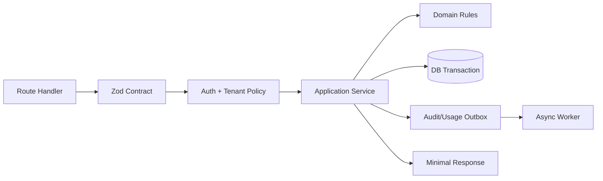
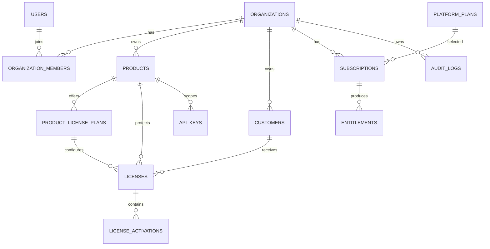
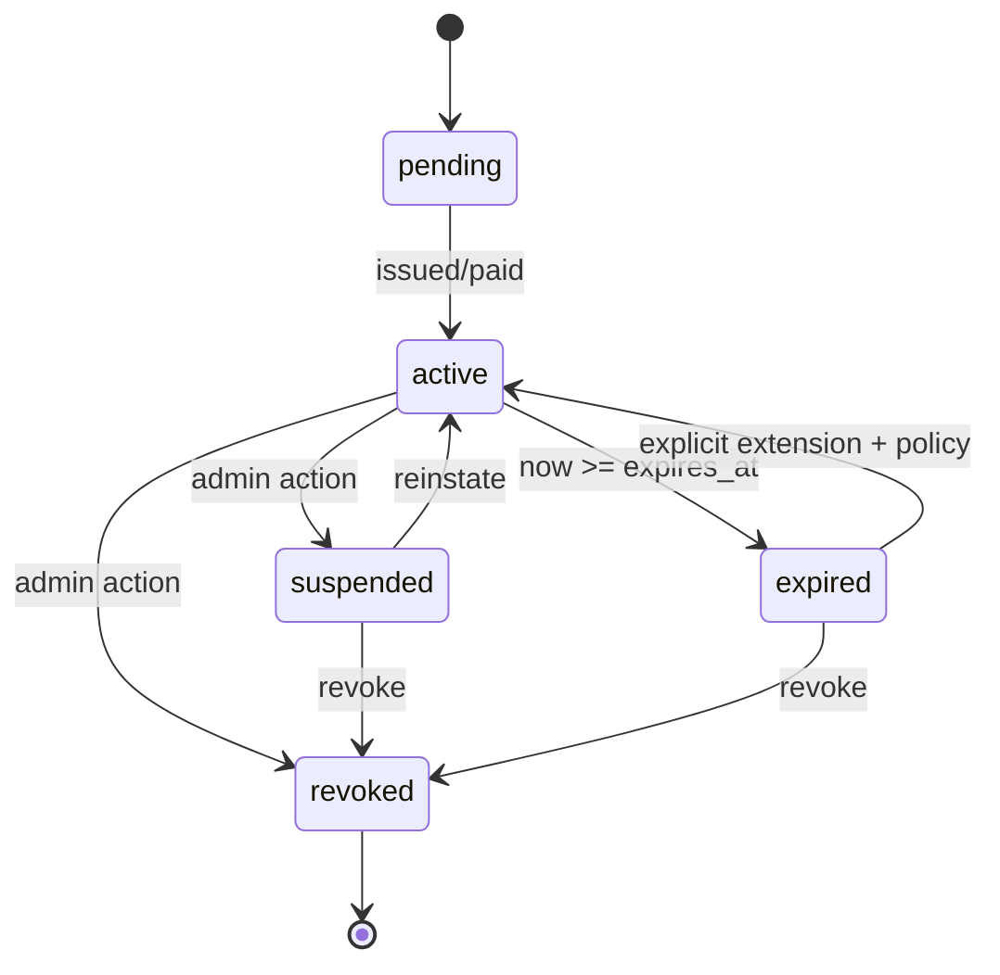
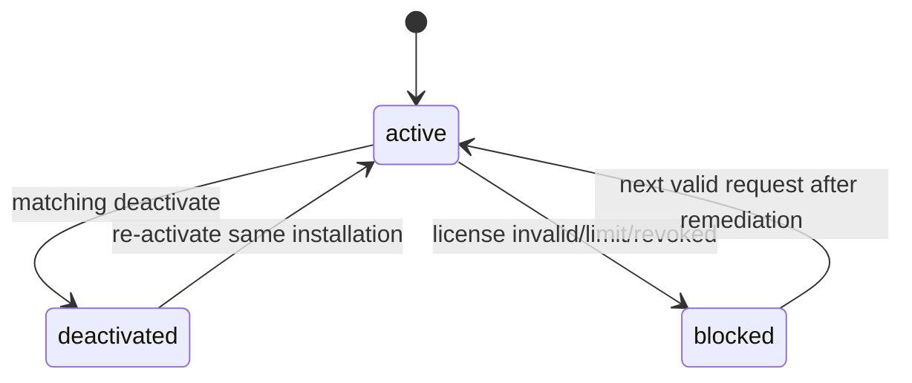
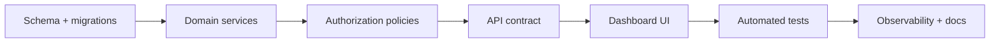

# Product Requirements Document (PRD)
# IndoLicense – SaaS License Management Platform

**Document Version:** 1.2  
**Status:** Development Ready – MVP Definition  
**Target Market:** Indonesia (initially), with architecture ready for broader/global market  
**Primary Users:** Software developers, plugin/theme developers, script vendors, SaaS/application vendors, software houses, agencies

---

## 1. Product Overview

### 1.1 Product Name

Brand/product name: **IndoLicense**

Product descriptor: **SaaS License Management Platform**

All customer-facing references, dashboard labels, documentation, SDK examples, and AI-generated
implementation artifacts should use **IndoLicense** as the product brand. The descriptor may be
used when explaining the product category.

The product is a SaaS platform that enables software developers and digital-product vendors to create, manage, activate, validate, revoke, and monitor licenses for their own software products.

Target software categories include:

- WordPress plugins
- WordPress themes
- PHP scripts
- Laravel / CodeIgniter applications
- Web applications
- SaaS/white-label applications
- cPanel / WHM plugins and related server-side software
- Other distributable developer products that need license enforcement

### 1.2 Core Value Proposition

The platform provides a ready-to-use licensing infrastructure so developers do not need to build their own license server, activation API, subscription entitlement system, and license dashboard.

Core positioning:

> **Create License, Activation, Subscription, and Update infrastructure for your software without building it from scratch.**

The product should feel like a developer infrastructure product rather than a simple license-key generator.

---

# 2. Problem Statement

Software vendors frequently need to solve problems such as:

- Restricting a product to specific domains or installations
- Limiting the number of activations
- Validating licenses remotely
- Handling license expiration and renewal
- Revoking compromised licenses
- Managing multiple products and plans
- Providing license APIs to plugins/scripts/applications
- Connecting payments to subscription entitlements
- Tracking activation history and audit events
- Providing update entitlement for distributed software

Building these capabilities independently requires backend development, database design, API security, webhook processing, billing logic, activation logic, dashboards, logging, and operational infrastructure.

The product solves this by providing a centralized licensing platform.

---

# 3. Goals

## 3.1 MVP Goals

The MVP must allow a developer to:

1. Create an account.
2. Create an organization/workspace.
3. Create software products.
4. Create plans for each product.
5. Configure activation limits and license duration.
6. Generate license keys.
7. View and manage licenses.
8. Activate licenses against a domain or installation.
9. Validate licenses through a public API.
10. Deactivate licenses.
11. Revoke/suspend licenses.
12. View activation history and audit logs.
13. Subscribe to a paid plan using Mayar.
14. Receive payment state through Mayar webhook.
15. Apply subscription entitlements to platform usage.
16. Provide a basic developer API integration path.

## 3.2 Long-Term Product Goals

The platform should evolve toward:

- License infrastructure as a service
- Subscription and entitlement management
- Software update distribution
- Developer SDKs
- Reseller/agency support
- Team collaboration
- Usage analytics
- Advanced anti-abuse controls
- Multiple payment providers
- Global-ready infrastructure

---

# 4. Non-Goals for MVP

The following are intentionally deferred:

- Full accounting system
- Full tax/invoicing engine
- Complex proration engine
- Multiple payment gateways on day one
- Marketplace for third-party software
- Full white-label platform
- Native desktop licensing SDKs
- Hardware-bound licensing as a primary model
- DRM or guaranteed anti-piracy protection
- Microservice architecture
- Kubernetes
- Multi-region deployment

The MVP should remain simple and focused on the licensing core.

---

# 5. Target Personas

## 5.1 Individual Developer

A developer selling a WordPress plugin, PHP script, Laravel application, or similar software.

Needs:

- Fast setup
- Low cost
- Simple API
- Domain activation
- License dashboard
- Basic support

## 5.2 Software House / Agency

A team developing software for multiple clients.

Needs:

- Multiple products
- Multiple team members
- Multiple client licenses
- Usage visibility
- Organization-based access control

## 5.3 Digital Product Vendor

A vendor selling scripts/themes/plugins or downloadable software.

Needs:

- License generation
- Activation tracking
- Subscription billing
- Revocation
- Update entitlement
- Customer management

---

# 6. Core Product Concepts

## 6.1 Organization

Top-level tenant boundary.

A user belongs to one or more organizations.

An organization owns:

- Products
- Plans
- Customers
- Licenses
- API keys
- Subscriptions
- Audit logs
- Webhook records

All resource access must be tenant-aware.

## 6.2 Product

A software product protected by the platform.

Examples:

- WooCommerce POS Plugin
- Laravel ERP
- cPanel Backup Plugin

## 6.3 Plan

A package defining product/license entitlements.

Examples:

- Free
- Starter
- Pro
- Agency
- Enterprise

A plan may define:

- License duration
- Activation limit
- Number of products
- Number of licenses
- API usage limits
- Team member limits
- Advanced feature access

## 6.4 License

A credential representing a customer's authorization to use a product.

Suggested properties:

- License ID
- Product
- Plan
- Customer
- Key prefix
- Key hash
- Status
- Start date
- Expiry date
- Activation limit
- Current activation count
- Created at
- Revoked/suspended at

## 6.5 License Activation

Represents one installation/domain associated with a license.

Possible identifiers:

- Domain
- Installation ID
- Optional IP metadata
- User agent metadata
- Activated at
- Last seen at
- Deactivated at

Domain should be normalized before comparison.

## 6.6 Customer

The end customer associated with a license/subscription.

Customer data should be kept separate from the software developer's authenticated user account.

## 6.7 Subscription

Represents the organization/customer's paid or trial relationship with a platform plan.

Subscription is distinct from a product license.

## 6.8 Entitlement

Defines what an organization is allowed to use on the SaaS platform.

Examples:

- Maximum products
- Maximum licenses
- Maximum activations
- API request quota
- Team members
- Analytics access

## 6.9 API Key

Credential used by a developer's server-side software to communicate with the License API.

API keys are separate from customer license keys.

## 6.10 Audit Log

Immutable or append-oriented record of important account, license, billing, activation, and administrative events.

---

# 7. MVP Feature Requirements

## 7.1 Authentication

### Requirements

- Sign up
- Sign in
- Sign out
- Session management
- Password reset
- Email verification if supported by the selected auth flow

### Security

- Secure session cookies
- No sensitive credentials in client-side code
- Server-side authorization checks

Better Auth digunakan sebagai authentication layer MVP. Application business logic tidak boleh
terikat langsung pada Better Auth API; gunakan Auth Adapter/identity service.

---

## 7.2 Organization & Multi-Tenancy

### Requirements

- Create organization
- Organization profile
- Organization membership
- Resource ownership through organization ID
- Tenant isolation

### Security Rule

Every resource query must enforce organization ownership.

Example conceptual access rule:

```text
Authenticated user
    -> organization membership
    -> resource ownership
    -> role/permission check
```

UUID/ULID identifiers are recommended, but they must never replace authorization checks.

---

## 7.3 Product Management

Developer can:

- Create product
- Edit product
- Archive product
- View product
- Generate/configure API credentials

Product fields may include:

- Name
- Slug
- Description
- Status
- Version metadata (future-compatible)
- Created/updated timestamps

---

## 7.4 Plan Management

Developer can create plans per product.

Example:

```text
Pro
Rp199.000 / month
5 activations
1 year / recurring subscription depending on billing model
```

Plan configuration should support:

- Name
- Description
- Price
- Billing interval
- License duration
- Activation limit
- Product access
- Feature flags
- Status

Exact pricing will be validated after MVP usage and customer feedback.

---

## 7.5 License Generation

### Requirements

- Generate secure random license keys
- Assign license to product and plan
- Assign customer
- Set activation limit
- Set expiration
- Set status
- Manually revoke/suspend
- Extend expiration

### Key Format

Human-friendly format is preferred, for example:

```text
LCS-7X9M-K2QP-8R4T
```

Implementation should use high-entropy random generation.

The database should preferably store a hash/fingerprint of the secret key rather than relying on plaintext key storage.

---

## 7.6 License Status Lifecycle

Recommended statuses:

```text
active
expired
revoked
suspended
pending
```

The final implementation may consolidate statuses when appropriate, but business rules must explicitly distinguish expiration, revocation, and suspension.

---

## 7.7 License Activation

### Endpoint

```http
POST /api/v1/licenses/activate
```

### Input

```json
{
  "license_key": "LCS-7X9M-K2QP-8R4T",
  "product_id": "prod_xxx",
  "domain": "example.com",
  "installation_id": "ins_xxx"
}
```

### Validation

- License exists
- License belongs to the requested product
- License is active
- License is not expired
- Activation limit is not exceeded
- Existing activation is handled idempotently
- Domain is normalized
- Installation is valid

### Concurrency

Activation limit enforcement must be safe under concurrent requests. Database transactions and/or appropriate constraints/locking must be used.

---

## 7.8 License Validation

### Endpoint

```http
POST /api/v1/licenses/validate
```

### Expected behavior

Return a minimal response containing only information required by the software integrating the API.

Example:

```json
{
  "valid": true,
  "status": "active",
  "expires_at": "2027-09-03",
  "plan": "pro"
}
```

Do not expose unnecessary customer or internal data.

### Availability Strategy

The client SDK should support short-lived local caching/signed license state where appropriate, so a temporary outage does not immediately disable customer software.

Grace period behavior should be configurable in a later phase.

---

## 7.9 License Deactivation

### Endpoint

```http
POST /api/v1/licenses/deactivate
```

The endpoint removes or disables an activation while keeping historical records for audit purposes.

---

## 7.10 License Revocation / Suspension

Administrative dashboard should support:

- Revoke license
- Suspend license
- Reactivate where business rules allow
- Extend license expiration

Actions must be audited.

---

# 8. Public API

## 8.1 Initial API Endpoints

```text
POST /api/v1/licenses/activate
POST /api/v1/licenses/validate
POST /api/v1/licenses/deactivate
GET  /api/v1/licenses/status
```

Future endpoints:

```text
POST /api/v1/licenses/refresh
GET  /api/v1/products/{product}
POST /api/v1/updates/check
GET  /api/v1/updates/download
```

## 8.2 API Authentication

Authentication depends on the caller:

- Public license endpoints (`activate`, `validate`, `deactivate`) use `product_public_id`+
  `license_key` and the installation context. They must not require a vendor secret embedded
  in customer software.
- Vendor management endpoints use a scoped secret API key.
- Webhook endpoints use provider signature/secret verification.

Example conceptual header:

```http
Authorization: Bearer sk_live_xxxxxxxxx
```

Secret API keys must never be exposed to browser/mobile/public client code or distributed
WordPress/PHP packages. A future publishable-key model requires a separate threat model and
explicit scope; it must not silently reuse a secret key.

## 8.3 API Key Lifecycle

- Create
- Display secret only when appropriate
- Store hash/fingerprint
- Revoke
- Replace/rotate
- Record last used timestamp

---

# 9. Billing & Payment

## 9.1 Payment Provider for MVP

**Mayar** is the planned payment gateway for the MVP.

Reasons for MVP selection:

- Suitable Indonesia-focused payment flow
- QRIS support
- Multiple payment methods
- API/webhook capabilities
- Subscription/SaaS-oriented functionality

## 9.2 Billing Architecture Principle

Mayar is the **payment provider**, not the application source of truth.

Application PostgreSQL remains the source of truth for:

- Subscription status
- Entitlements
- Internal plan mapping
- Platform access
- License consequences

## 9.3 Billing Flow

```text
Customer
  -> Pricing page
  -> Select plan
  -> Create Mayar checkout/invoice
  -> Payment
  -> Mayar webhook
  -> Backend verification
  -> Update payment
  -> Update subscription
  -> Update entitlements
  -> Apply license/platform state
```

## 9.4 Payment Status

Suggested payment states:

```text
pending
paid
failed
expired
refunded
```

## 9.5 Subscription Status

Suggested subscription states:

```text
trialing
active
past_due
cancelled
expired
suspended
```

## 9.6 Webhook Security

Webhook flow:

```text
Receive webhook
 -> Verify authenticity/signature if supported
 -> Validate payload
 -> Check event ID
 -> Check idempotency
 -> Process in DB transaction
 -> Record event
 -> Return success
```

Database should enforce a uniqueness rule for provider + event ID.

Duplicate webhook deliveries must not create duplicate subscriptions, licenses, or payments.

## 9.7 Grace Period

Recommended business behavior:

```text
Payment failure
    -> past_due
    -> grace period
    -> suspend only after grace period
```

Customer software should not immediately stop functioning due to a short billing disruption.

Exact grace period duration is a business decision to be validated.

---

# 10. Paywall & Packaging

## 10.1 Recommended Model

Freemium + usage-based entitlements.

Example structure:

### Free

- 1 product
- Small number of licenses
- Limited activations
- Basic API
- Community support

### Starter

- More products
- More licenses
- More activations
- Webhooks
- Basic analytics

### Pro

- Higher/unlimited limits depending on validated economics
- Advanced analytics
- Teams
- Priority support
- Advanced configuration

### Agency

- Multi-project management
- Higher quotas
- Client/reseller capabilities
- White-label features in future

These limits are placeholders and must be validated against market usage and support costs.

## 10.2 Paywall Principle

Paywall should primarily be based on resource/value, not only UI features.

Examples:

- Number of products
- Number of licenses
- Number of activations
- API quota
- Team members

This makes pricing easier to understand for developers.

---

# 11. Billing vs License Separation

Billing and software licensing must remain separate domains.

Recommended model:

```text
Customer
   -> Subscription
       -> Plan
           -> Entitlements

Customer
   -> Product License
       -> Activation(s)
```

Payment success should not directly manipulate only `license.expires_at`.

The system should process:

```text
Payment
 -> Order/Transaction
 -> Subscription
 -> Entitlement
 -> License outcome
```

This allows future plan changes, payment failures, upgrades, downgrades, and multiple licenses per subscription.

---

# 12. Recommended Database Model

The initial PostgreSQL schema should conceptually contain:

```text
users
organizations
organization_members

products
plans

customers

subscriptions
subscription_items

orders
payments
invoices

licenses
license_activations

entitlements

api_keys
webhook_events
audit_logs
```

## 12.1 Important Relationships

```text
Organization
  |
  +-- Products
  |     +-- Plans
  |
  +-- Customers
  |
  +-- Subscriptions
  |
  +-- Licenses
  |     +-- Activations
  |
  +-- API Keys
  |
  +-- Audit Logs
```

## 12.2 Database Requirements

Use:

- Foreign keys
- Unique constraints
- Check constraints where useful
- Appropriate indexes
- Transactions
- Explicit tenant ownership

Important examples:

```text
UNIQUE(provider, event_id)
UNIQUE(product_id, license_key_hash)
UNIQUE(license_id, installation_id)
```

Exact constraints depend on final schema and business rules.

---

# 13. Security Requirements

Security is a first-class product requirement.

## 13.1 Authentication

- Secure session management
- Password reset protection
- No secret credentials in client-side code

## 13.2 Authorization

Must protect against:

- Cross-tenant data access
- Broken object-level authorization
- Broken function-level authorization

Every resource access must verify organization ownership and permission.

## 13.3 API Security

- Input validation with Zod or equivalent
- Rate limiting
- Request size limits
- Safe error messages
- Minimal response payloads
- Authentication/authorization separation
- Abuse monitoring

## 13.4 License Key Security

- High entropy
- No sequential predictable keys
- Hash/fingerprint storage where practical
- No sensitive customer data in validation response

## 13.5 API Key Security

- Separate from license keys
- Server-side only for secrets
- Revocable
- Rotatable
- Hashed/fingerprinted storage where practical

## 13.6 Webhook Security

- Verify provider authenticity/signature when supported
- Idempotency
- Payload validation
- Database transaction processing
- Audit trail

## 13.7 Secret Management

Secrets must be kept in environment variables/secret storage and must never be committed to Git.

Examples:

- Mayar secret
- Supabase service role key
- Database credentials
- Internal signing keys

## 13.8 Security Headers

Production web app should use appropriate security headers such as:

- HTTPS
- HSTS
- Content-Security-Policy where practical
- X-Content-Type-Options
- Referrer-Policy
- Secure cookies

## 13.9 Database Security

Application should use parameterized queries / ORM-safe query mechanisms.

Race-sensitive operations such as activation limits must be transactionally protected.

## 13.10 Audit Logging

Log important events including:

- Login/security events
- Product creation
- Plan changes
- License creation
- License activation
- License deactivation
- License revocation
- Subscription changes
- Payment webhook events
- API key creation/revocation
- Administrative actions

---

# 14. Anti-Abuse Requirements

The platform must anticipate API abuse.

Controls should include:

- Rate limiting
- API quotas
- API key revocation
- Usage monitoring
- Basic anomaly detection
- Temporary throttling

The system should be able to identify unusual validation/activation traffic.

---

# 15. License Enforcement Philosophy

The platform must not claim 100% piracy prevention.

For distributed PHP/WordPress software, an attacker may modify customer-side code.

The product instead provides:

- Central license validation
- Activation control
- Domain/install management
- Revocation
- Subscription enforcement
- Update entitlement
- Usage visibility
- Audit trails

The product should position itself as a licensing and entitlement infrastructure rather than an unbreakable DRM system.

---

# 16. Offline/Temporary-Outage Strategy

To reduce operational impact on customer software:

1. Software validates online periodically.
2. SDK may cache a successful license state.
3. SDK may use a short grace period.
4. Temporary API outage should not immediately disable a valid customer license.
5. Repeated failure/expiry rules must be explicit.

A future option is a signed license response/token so the client can cryptographically validate a previously issued state.

---

# 17. Technology Stack

## 17.1 MVP

### Frontend

- Next.js
- TypeScript
- TanStack Query untuk server-state yang membutuhkan client cache/invalidation
- TanStack Table untuk tabel data besar/complex
- Tailwind CSS
- shadcn/ui

### Backend

- Next.js Route Handlers / API routes
- TypeScript
- Zod

### Database

- PostgreSQL
- Supabase during MVP
- Drizzle ORM
- Drizzle Kit for migrations and schema workflow
- Drizzle Studio for local data inspection and debugging

### Authentication

- Better Auth during MVP

### Hosting

- Vercel during MVP

### SDK

Initial target:

- Generic REST API
- PHP SDK / reference implementation
- WordPress integration helper in a later MVP iteration

### Testing

- Vitest
- Playwright

### Source Control

- GitHub

---

## 17.2 Supabase-First Development Workflow

Development MVP langsung menggunakan Supabase PostgreSQL. Developer/AI agent harus meminta
config Supabase yang akan dipakai sebelum menjalankan migration atau membuat koneksi database.
Tidak ada asumsi database lokal, SQLite, atau project Supabase tertentu.

```text
User menyediakan Supabase config
      |
      v
Validasi environment variables
      |
      v
Drizzle schema + Drizzle Kit migration
      |
      v
Supabase PostgreSQL
      |
      v
Drizzle Studio untuk inspect/debug terbatas
      |
      v
Seed + integration tests
      |
      v
Next.js localhost
```

### Supabase Configuration Checklist

Sebelum development database dimulai, minta user menyediakan:

- Supabase project URL.
- Direct PostgreSQL connection string untuk Drizzle migration/admin operation.
- Pooled connection string jika runtime membutuhkan connection pooling.
- Better Auth URL dan server-only secret.
- Environment target: development, staging, atau production.
- Konfirmasi apakah database boleh dimigration dan apakah data existing harus dipertahankan.

Credential sensitif harus dikirim melalui environment/secret manager, bukan ditulis ke source
code, commit, issue, atau chat log. `.env.local` harus masuk `.gitignore`.

### Drizzle Workflow with Supabase

- Drizzle schema menjadi sumber definisi tabel aplikasi.
- Migration dibuat melalui Drizzle Kit dan disimpan di repository.
- Migration dijalankan ke Supabase menggunakan connection string yang sesuai.
- Drizzle Studio boleh digunakan untuk browsing dan debugging terbatas.
- Perubahan schema tidak dilakukan manual melalui Supabase Dashboard atau Drizzle Studio;
  perubahan harus berasal dari migration yang direview.
- Seed script harus idempotent dan hanya digunakan pada project development/staging, kecuali
  prosedur production telah disetujui.
- Drizzle Studio dan migration harus memakai connection mode yang sesuai; jangan membocorkan
  connection string pada output terminal atau log CI.

### Recommended Commands

Nama script dapat disesuaikan, tetapi workflow harus menyediakan command yang setara:

```bash
npm run db:generate
npm run db:migrate
npm run db:seed
npm run db:studio
npm run dev
```

Command tersebut dijalankan setelah environment Supabase tervalidasi. `db:generate` hanya
membuat migration dari perubahan schema; `db:migrate` menerapkan migration ke target Supabase.

### Database Safety Rules

- Selalu konfirmasi target project dan environment sebelum migration.
- Backup atau snapshot database harus tersedia sebelum migration yang berisiko.
- Migration harus diuji pada staging/development sebelum production.
- Jangan menggunakan reset/drop database pada project yang berisi data penting.
- Integration test concurrency activation tetap wajib dijalankan pada PostgreSQL Supabase;
  SQLite tidak digunakan sebagai compatibility target MVP.
- Better Auth schema dan domain logic tetap dikendalikan melalui Drizzle/application migration;
  Better Auth tidak boleh menjadi sumber authorization tenant tanpa application policy.

---

# 18. Production Infrastructure Strategy

Production will initially move away from Vercel/Supabase to owned infrastructure when the product is validated.

Planned environment:

- VPS
- Coolify
- Docker
- Next.js application container
- Worker/background-job container where needed
- PostgreSQL
- Optional Redis later
- Cloudflare or equivalent reverse-proxy/DNS layer

## 18.1 Infrastructure Principle

The application should not be tightly coupled to Vercel or Supabase-only capabilities.

Primary application contract:

```text
Next.js
 -> Drizzle
 -> PostgreSQL
```

Supabase should primarily be treated as the managed PostgreSQL/Auth infrastructure during MVP.

## 18.2 Migration

Target migration path:

```text
Supabase PostgreSQL
      -> database dump/restore
      -> production PostgreSQL
```

Database schema must be migration-controlled using Drizzle migrations.

---

# 19. Suggested Application Architecture

```text
license-platform/
│
├── app/
│   ├── dashboard/
│   ├── api/
│   │   └── v1/
│   │       └── licenses/
│   │           ├── activate/
│   │           ├── validate/
│   │           └── deactivate/
│   └── auth/
│
├── components/
│
├── lib/
│   ├── auth/
│   ├── db/
│   ├── license/
│   ├── billing/
│   ├── crypto/
│   ├── validation/
│   └── permissions/
│
├── drizzle/
│   └── schema.ts
│
├── sdk/
│   └── php/
│
├── tests/
│
└── package.json
```

Business logic should be separated from dashboard UI.

The license engine should be treated as a reusable core module.

## 19.1 Lightweight Architecture Decision

MVP menggunakan **modular monolith**, bukan microservices. Satu Next.js application dapat
menyediakan dashboard, public API, management API, dan webhook endpoint selama boundary
modul dan authorization tetap tegas.

Prinsip utama:

- Route Handler/Server Action tipis: parse input, authenticate, authorize, panggil service,
  map response.
- Business rule hanya berada di domain/application service, tidak di React component atau
  route handler.
- Repository hanya menangani persistence/query; repository tidak menentukan policy bisnis.
- Transaksi dibuat di application service untuk operasi lintas repository.
- Integrasi Mayar, email, rate limiter, dan clock memakai port/interface agar domain tidak
  terikat vendor.
- Read-heavy dashboard boleh memakai query khusus/read model sederhana; tidak perlu CQRS penuh.
- Background worker hanya untuk webhook retry, reconciliation, notification, usage aggregation,
  dan scheduled expiry. License activate/validate tetap synchronous dan singkat.
- Tidak menambahkan Redis, queue, event bus, atau separate service sebelum ada kebutuhan yang
  terukur. Rate limiting MVP boleh memakai provider/infrastructure yang konsisten.

## 19.2 Recommended Module Boundaries

```text
src/
├── app/                         # Next.js routes, pages, layouts
│   ├── (dashboard)/
│   ├── (admin)/
│   └── api/
├── modules/
│   ├── identity/                # auth, organizations, memberships, RBAC
│   ├── catalog/                 # products, product license plans
│   ├── licensing/               # licenses, activations, status rules
│   ├── billing/                 # platform plans, orders, payments, subscriptions
│   ├── entitlements/            # quota and feature evaluation
│   ├── developer-api/           # API keys, public API contract, rate limits
│   ├── audit/                   # audit events
│   └── platform-admin/          # internal admin operations
├── infrastructure/
│   ├── db/                      # Drizzle schema, migrations, repositories
│   ├── providers/               # Mayar, email, storage
│   ├── jobs/                    # worker handlers and schedules
│   └── observability/           # logs, metrics, tracing
├── shared/
│   ├── contracts/               # Zod schemas, API envelopes, error codes
│   ├── security/                # hashing, keys, masking
│   └── result/                  # typed success/failure helpers
└── tests/
```

Setiap module idealnya memiliki `domain`, `application`, `contracts`, dan `infrastructure`
internal. Modul tidak boleh mengakses tabel modul lain secara langsung; gunakan application
service atau query contract. Ini penting agar AI tidak membuat coupling tersembunyi.

## 19.3 Request Flow



Untuk `validate`, flow dapat lebih pendek karena read-only:

```text
Route Handler
  -> validate request
  -> resolve public product/license fingerprint
  -> evaluate effective license status
  -> return minimal response
```

Untuk `activate`, gunakan transaction invariant pada Section 35.7. Untuk webhook, simpan event
terlebih dahulu secara idempotent, lalu proses subscription state dalam transaction/worker.

## 19.4 Performance and Simplicity Rules

- Dashboard list wajib pagination; jangan mengambil seluruh licenses/activations.
- Pilih kolom yang diperlukan; hindari `SELECT *` pada public API.
- Buat index berdasarkan query nyata: tenant, product, license hash, installation, status,
  created_at, dan provider event ID.
- Public validate tidak boleh memuat relasi customer, subscription, atau audit log yang tidak
  diperlukan.
- Cache hanya hasil yang aman dan berumur pendek; jangan cache authorization decision tanpa
  tenant/key invalidation yang jelas.
- Gunakan satu database transaction untuk satu business operation penting.
- Hindari N+1 query pada dashboard melalui query repository khusus.
- Jangan menambahkan abstraction generik yang belum punya dua use case nyata.
- Logging default harus structured dan ringkas; payload license key/API key wajib dimasking.

## 19.5 Business Logic Placement Rules

| Logic | Lokasi |
|---|---|
| Parse/shape request | Contract/schema |
| User session check | Auth adapter/middleware |
| Tenant and role permission | Policy/application layer |
| License expiry/status | Licensing domain service |
| Activation concurrency | Licensing application service + DB transaction |
| Plan limit evaluation | Entitlement service |
| Mayar signature mapping | Billing provider adapter |
| Webhook idempotency | Billing application service + database constraint |
| Response formatting | API presenter/route layer |
| Audit event creation | Application service |
| Table sorting/filtering UI | Dashboard/query layer |

Business logic yang terduplikasi di page, API route, dan SDK dianggap defect dan harus
dipindahkan ke shared application/domain service.

---

# 20. Dashboard Requirements

The platform has two clearly separated dashboard surfaces:

1. **Developer / Customer Dashboard** — used by organizations that use the platform to manage their own software products and licenses.
2. **Internal Administrator Dashboard** — used by the platform operator to manage organizations, billing, security, support, and system operations.

These dashboards must have separate route namespaces, permission models, and navigation structures even if they are implemented within the same Next.js application.

---

## 20.1 Developer / Customer Dashboard

### Purpose

The Developer Dashboard is the primary customer-facing control panel. It allows software vendors to configure their products, manage licensing, view usage, and manage their subscription with the platform.

### Primary Navigation

```text
Dashboard
Products
Licenses
Customers
Activations
API
Billing
Team
Settings
Documentation
```

### 20.1.1 Overview

Show:

- Current subscription and plan
- Subscription status
- Usage against plan limits
- Product count
- License count
- Active activation count
- API request volume
- Recent license events
- Recent payment/billing events
- Security notices

Example layout:

```text
┌─────────────────────────────────────────────────────────┐
│ PRO PLAN                         Active                 │
│ Next billing: 03 Oct 2026                              │
├─────────────────────────────────────────────────────────┤
│ Products     Licenses      Activations      API Calls   │
│ 5 / 20       1,240 / 10K   3,850 / 50K     18K / 100K │
├─────────────────────────────────────────────────────────┤
│ Recent Activity                                        │
│ License activated                                      │
│ License revoked                                        │
│ Payment received                                       │
└─────────────────────────────────────────────────────────┘
```

### 20.1.2 Products

Developer can:

- Create product
- Edit product
- Archive product
- View product details
- View plans belonging to the product
- View license totals
- View activation totals
- Manage API credentials associated with the product
- View recent product activity

Product detail page should contain tabs or sections for:

```text
Overview
Plans
Licenses
Activations
API Keys
Activity
Settings
```

### 20.1.3 Plans

Developer can:

- Create plan
- Edit plan
- Archive/deactivate plan
- Configure price and billing interval
- Configure license duration
- Configure activation limit
- Configure platform entitlements
- Configure feature flags

Plan changes must have explicit rules for whether they affect only new licenses or also existing licenses.

### 20.1.4 Licenses

The license list should support:

- Search by license key/prefix
- Search by customer
- Filter by product
- Filter by plan
- Filter by status
- Filter by expiration
- Sort by created/expiry/activity date

License detail should show:

- Product
- Plan
- Customer
- Status
- Created date
- Start date
- Expiry date
- Activation limit
- Current activation count
- Activation history
- Audit history

Allowed actions:

```text
Create
Extend
Revoke
Suspend
Reactivate (subject to rules)
Deactivate activation
```

Sensitive values must be masked by default.

### 20.1.5 Customers

Developer can:

- View customers associated with their organization
- Search customers
- View customer profile
- View customer licenses
- View customer subscription/order context where appropriate
- Review customer activity

The developer dashboard must not expose internal platform-only billing or security information.

### 20.1.6 Activations

Provide:

- Active activations
- Deactivated activations
- Domain
- Installation ID
- First activation time
- Last seen time
- Product
- License
- Customer

Actions:

- Deactivate activation
- View associated license

### 20.1.7 API

Subsections:

```text
API Overview
API Keys
Usage
Webhooks
Documentation
```

Show:

- API keys
- Key status
- Last used timestamp
- API request counts
- Error counts
- Rate-limit events
- Webhook delivery status

Secret API keys should only be displayed in full at creation/rotation when appropriate.

### 20.1.8 Billing

Show:

- Current subscription
- Current plan
- Subscription status
- Next billing date where applicable
- Usage/entitlement summary
- Payment history
- Invoices/payment references provided by the payment provider
- Upgrade/downgrade options
- Cancellation option

Billing UI must explain the effect of a plan change before confirmation.

### 20.1.9 Team

Organization owners/admins can:

- Invite members
- Remove members
- Assign organization roles
- Review invitations
- Review recent team activity

Initial organization roles:

```text
Owner
Admin
Developer
Viewer
```

### 20.1.10 Settings

Organization settings may include:

- Organization name
- Organization profile
- Security settings
- Default settings
- Notification preferences
- API/webhook settings
- Account deletion request

Dangerous actions such as deleting an organization require explicit confirmation and should be owner-only.

---

## 20.2 Internal Administrator Dashboard

### Purpose

The Internal Admin Dashboard is a private backoffice for operating the SaaS platform.

It is not part of the customer-facing product and must use a separate internal permission model.

### Primary Navigation

```text
Overview
Organizations
Users
Products
Plans
Subscriptions
Payments
Licenses
Activations
API / Usage
Webhooks
Audit Logs
Security / Abuse
Support
System Settings
```

### 20.2.1 Admin Overview

Show platform-wide metrics:

- Total organizations
- Active organizations
- New organizations
- Active subscriptions
- Monthly recurring revenue or billing proxy where reliable
- Payment failures
- Total products
- Total licenses
- Active activations
- License API requests
- API error rate
- Webhook failures
- Security/rate-limit alerts

The dashboard should highlight operational anomalies rather than only aggregate numbers.

### 20.2.2 Organizations

Admin can:

- Search organizations
- View organization profile
- View owner and members
- View plan/subscription
- View usage
- View products and licenses
- View billing/payment summary
- Suspend platform access where policy permits
- Add internal notes
- Review audit history

Destructive operations should require elevated permission and confirmation.

### 20.2.3 Users

Admin can:

- Search users
- View account metadata
- View organization membership
- View security/authentication events available to the platform
- Disable/suspend access where justified and authorized
- Review audit events

Passwords and authentication secrets must never be visible to administrators.

### 20.2.4 Platform Product/Plan View

Internal admins can inspect products and plans across organizations for support and operations.

The admin dashboard should distinguish between:

```text
Customer-owned configuration
Platform-level configuration
```

Admin changes must be explicitly audited.

### 20.2.5 Subscriptions

Provide:

- Organization
- Plan
- Status
- Provider
- Billing interval
- Current period
- Renewal date
- Past-due state
- Cancellation state

Admin actions may include:

- View provider references
- View event history
- Apply approved support adjustment
- Suspend subscription/platform access according to policy

Manual billing state changes should be rare, permission-controlled, and fully audited.

### 20.2.6 Payments

Show:

- Payment ID
- Provider
- Provider transaction/reference ID
- Organization/customer
- Amount/currency
- Status
- Timestamp
- Related subscription/order
- Webhook processing status

Do not store or expose raw payment credentials.

### 20.2.7 Licenses

Internal admins may search and inspect licenses across all organizations.

Use cases:

- Customer support
- Abuse investigation
- Incident response
- Data integrity investigation

Admin license actions must be permission-controlled and audited.

### 20.2.8 Activations

Provide platform-wide visibility into:

- Activation volume
- High-frequency domains/installations
- Repeated failed activation attempts
- Unusual activation patterns
- Organization/product/license context

### 20.2.9 API / Usage

Admin view should provide:

- Requests per organization
- Requests per API key/product
- Error rate
- Latency
- Rate-limit events
- Suspicious traffic
- Top consumers

Usage data should support both operational troubleshooting and future pricing decisions.

### 20.2.10 Webhooks

Webhook operations page should show:

- Provider
- Event ID
- Event type
- Received time
- Processing status
- Retry count
- Error message
- Related payment/subscription

Admin should be able to safely retry failed webhook processing where supported.

Retry actions must preserve idempotency.

### 20.2.11 Audit Logs

Audit logs should be searchable and filterable by:

- Organization
- User
- Actor type
- Event type
- Resource type
- Resource ID
- Date/time
- Result/status

Actor types may include:

```text
User
System
Webhook
Internal Admin
```

Audit records must not be editable through normal application UI.

### 20.2.12 Security / Abuse

Provide operational views for:

- Rate-limit events
- Suspicious API activity
- Repeated failed authentication events
- Abnormal activation behavior
- Revoked API keys
- Security alerts

Recommended actions:

- Review
- Rate-limit
- Revoke API key
- Suspend organization where authorized
- Add internal incident note

### 20.2.13 Support

The admin dashboard should support controlled customer troubleshooting.

A future/initial capability may include **read-only impersonation** or **support session access**.

Rules:

- Never request or expose customer passwords.
- Support sessions should be explicit and time-limited.
- The customer/account being accessed must be recorded.
- All support-session actions must be audited.
- Sensitive operations remain blocked unless explicitly authorized by a higher role.

### 20.2.14 System Settings

Reserved for platform-level settings such as:

- Feature flags
- Rate-limit defaults
- Maintenance mode
- Notification configuration
- Internal operational settings

Production secrets must not be editable through a normal database-backed web form unless a dedicated secure secret-management workflow is implemented.

---

## 20.3 Dashboard Route Structure

Recommended Next.js route separation:

```text
/app
  /(dashboard)
    /dashboard
    /products
    /plans
    /licenses
    /customers
    /activations
    /api
    /billing
    /team
    /settings

  /(admin)
    /admin
    /admin/organizations
    /admin/users
    /admin/products
    /admin/plans
    /admin/subscriptions
    /admin/payments
    /admin/licenses
    /admin/activations
    /admin/usage
    /admin/webhooks
    /admin/audit-logs
    /admin/security
    /admin/support
    /admin/settings
```

The exact filesystem grouping can vary, but customer and internal-admin authorization boundaries must remain explicit.

---

## 20.4 RBAC & Permission Model

### Customer Organization Roles

| Permission Area | Owner | Admin | Developer | Viewer |
|---|---:|---:|---:|---:|
| View organization | Yes | Yes | Yes | Yes |
| Manage organization | Yes | Yes | No | No |
| Manage team | Yes | Yes | No | No |
| Create/edit products | Yes | Yes | Yes | No |
| Manage plans | Yes | Yes | Yes | No |
| Create/manage licenses | Yes | Yes | Yes | No |
| Manage activations | Yes | Yes | Yes | Yes |
| Manage API keys | Yes | Yes | Yes | No |
| View usage | Yes | Yes | Yes | Yes |
| Manage billing | Yes | Yes | No | No |
| Cancel subscription | Yes | Policy-dependent | No | No |
| View audit logs | Yes | Yes | Limited | No |
| Delete organization | Yes | No | No | No |

### Internal Platform Roles

Initial roles:

```text
Super Admin
Support Admin
Billing Admin
Security Admin
Read-only Admin
```

Recommended scope:

| Area | Super | Support | Billing | Security | Read-only |
|---|---:|---:|---:|---:|---:|
| Organizations | Full | View | View | View | View |
| Users | Full | View/Support | View | Security actions | View |
| Subscriptions | Full | View | Full | View | View |
| Payments | Full | View | Full | View | View |
| Licenses | Full | Support actions | View | Abuse actions | View |
| Activations | Full | View | View | Full | View |
| API usage | Full | View | View | Full | View |
| Webhooks | Full | View/retry | Full | View | View |
| Audit logs | Full | View | View | Full | View |
| Security/abuse | Full | Limited | No | Full | View |
| System settings | Full | No | No | Security-only | No |

Actual permission enforcement should be capability-based rather than relying solely on UI visibility.

---

## 20.5 Dashboard Security Requirements

- Customer dashboard routes require authenticated organization membership.
- Every resource query must enforce tenant ownership.
- Admin routes must require an internal-admin role.
- Customer users must never gain admin access through manipulated role fields from the client.
- Permission checks must run on the server.
- Sensitive actions require explicit authorization and may require re-authentication/step-up authentication in a future phase.
- Admin actions must create audit records.
- Support/impersonation sessions must be clearly identified in logs.
- Destructive operations should use confirmation and, where appropriate, typed confirmation.

---

# 21. Developer Experience


Developer setup should be designed to minimize friction.

Desired flow:

```text
Sign up
  -> Create Product
  -> Create Plan
  -> Create/Test License
  -> Copy API credentials
  -> Integrate SDK/API
  -> Activate License
  -> Validate License
```

The developer should be able to test licensing before paying for a paid platform plan.

Documentation should contain copy/paste-ready examples.

---

# 22. Initial SDK Requirements

Initial PHP helper/library should provide methods similar to:

```php
$client->activate($licenseKey, $domain);
$client->validate();
$client->deactivate();
```

Later:

```php
$client->checkUpdate();
$client->downloadUpdate();
```

SDK should handle:

- API authentication
- Timeouts
- Request retries where appropriate
- JSON parsing
- Error normalization
- Local cache where applicable
- Graceful API outage behavior

---

# 23. Update Distribution – Future Module

A future module can add:

```text
Product
  -> Releases
      -> v1.0.0
      -> v1.1.0
      -> v1.2.0
```

Software can then ask:

```text
Is license valid?
Is update entitlement available?
What is the latest allowed version?
Where is the update package?
```

This creates a broader value proposition:

> License + Update + Distribution Infrastructure

This is not required for the initial MVP but should influence API/data-model extensibility.

---

# 24. Observability

MVP:

- Application logs
- Audit logs
- Basic API usage metrics
- Error logging

Production:

- Sentry or equivalent
- Structured logs
- Database monitoring
- API latency monitoring
- Error-rate alerts
- API abuse monitoring
- Infrastructure metrics

Do not keep unlimited raw API request logs in the primary database.

Suggested retention strategy should be implemented before production scale.

---

# 25. Backup & Disaster Recovery

## MVP

Use managed database backup capabilities where available and maintain export capability.

## Production

- Automated PostgreSQL backups
- Off-site backup destination
- Backup encryption
- Retention policy
- Restore testing

Principle:

> A backup is not considered reliable until restoration has been tested.

---

# 26. Testing Requirements

## 26.1 Unit Tests

Test:

- License status calculation
- Expiry logic
- Activation limit logic
- Domain normalization
- Entitlement calculation
- Subscription state transitions
- Webhook event parsing

## 26.2 Integration Tests

Test:

- Database transactions
- License activation flow
- License validation flow
- Mayar webhook processing
- Idempotent webhook handling
- API key authentication

## 26.3 Security/Authorization Tests

Must include scenarios such as:

```text
User A cannot access Organization B resources
User A cannot access Product B licenses
API key from Product A cannot manage Product B
Revoked API key cannot call the API
Expired license cannot activate
Revoked license cannot activate
Activation limits cannot be bypassed concurrently
Duplicate webhook cannot create duplicate subscription
Tampered/invalid webhook cannot update billing state
Suspended subscription cannot access restricted platform features
```

## 26.4 End-to-End Tests

Use Playwright for critical flows:

```text
Signup
 -> Create organization
 -> Create product
 -> Create plan
 -> Create license
 -> Verify license in API
```

Billing E2E should be tested using provider sandbox/test mode where supported.

---

# 27. Security Reference Standards

The security checklist should use:

- OWASP Application Security Verification Standard (ASVS)
- OWASP API Security Top 10

These should guide secure design, code review, testing, API hardening, authorization, authentication, cryptography, and logging.

---

# 28. Metrics / KPIs

Important MVP metrics:

## Acquisition

- New developer accounts
- New organizations
- Product creations

## Activation

- Percentage of developers creating first product
- Percentage creating first license
- Percentage making first successful license API call

## Conversion

- Free to paid conversion
- Trial to paid conversion, if trial is introduced
- Average revenue per organization

## Product Usage

- Licenses created
- License activations
- License validations
- Active products
- Active subscriptions
- API requests

## Reliability

- License API success rate
- API latency
- Webhook processing failures
- Authentication failures

## Abuse

- Rate-limited requests
- Suspicious activation patterns
- Revoked API keys

---

# 29. MVP Acceptance Criteria

The MVP is ready for controlled public testing when:

1. User can register and log in.
2. User can create an organization.
3. User can create at least one product.
4. User can create a plan.
5. User can create a license.
6. License can be activated through the public API.
7. License can be validated through the public API.
8. License can be deactivated.
9. License can expire/revoke correctly.
10. Activation limits are correctly enforced under concurrent requests.
11. Cross-tenant access is prevented.
12. API keys can be revoked.
13. Rate limiting is active on public API endpoints.
14. Mayar payment can be initiated.
15. Successful Mayar webhook can activate the appropriate subscription state.
16. Duplicate webhook events are idempotent.
17. Billing state and license state are not incorrectly coupled.
18. Audit logs exist for critical events.
19. Basic dashboard is usable.
20. Critical flows have automated tests.

---

# 30. Roadmap

## Phase 1 – MVP Core

```text
Authentication
Multi-tenancy
Products
Plans
Licenses
Activations
Validation API
Deactivation
Revocation
Audit logs
Basic dashboard
```

## Phase 2 – Billing

```text
Mayar integration
Checkout
Webhook processing
Subscription states
Entitlements
Paywall
Usage limits
```

## Phase 3 – Developer Experience

```text
PHP SDK
WordPress helper/plugin
Developer documentation
API dashboard
Usage metrics
Better error tooling
```

## Phase 4 – Production Infrastructure

```text
VPS
Coolify
Docker
PostgreSQL
Backups
Monitoring
Redis if required
Cloudflare
```

## Phase 5 – Advanced Product

```text
Update server
Release management
Resellers
Agency accounts
Team permissions
White-label
Multiple payment providers
Advanced analytics
Advanced abuse detection
```

---

# 31. Key Architecture Principles

1. **PostgreSQL is the source of truth for application state.**
2. **Mayar is the payment provider, not the billing database of record.**
3. **License state and subscription state are separate concepts.**
4. **Organization is the primary tenant boundary.**
5. **Authorization must always enforce tenant ownership.**
6. **License keys and API keys are different credentials.**
7. **Webhook processing must be idempotent.**
8. **Public license API must be rate-limited and abuse-resistant.**
9. **License API outages should not instantly break valid customer software.**
10. **Business logic must not depend heavily on Vercel/Supabase-specific features.**
11. **MVP should remain monolithic and simple.**
12. **Future infrastructure migration should be possible without rewriting the core application.**
13. **Security and auditability are core features, not optional add-ons.**
14. **The product should not claim impossible 100% anti-piracy protection.**

---

# 32. Decisions for the Technical Design Stage

These should be resolved before implementation begins:

- Exact organization/member role model
- Exact database schema and indexes
- Exact license key generation and hashing strategy
- Signed license response/token design
- API versioning policy
- Rate-limit values per plan
- Usage quota model
- Mayar webhook event mapping
- Billing renewal behavior
- Grace period duration
- Upgrade/downgrade behavior
- Refund/cancellation behavior
- Domain normalization rules
- Installation ID generation strategy
- API error code catalog
- Log retention policy
- Production backup policy
- Final pricing and plan limits

---

# 33. Recommended Initial Development Order

The implementation should proceed in this order:

```text
1. Domain model & PostgreSQL schema
2. Authentication
3. Organization & permissions
4. License engine
5. Public License API
6. Security/rate limiting
7. Dashboard
8. Mayar billing integration
9. Entitlement/paywall
10. PHP/WordPress developer integration
11. Observability
12. Production deployment
```

This order prioritizes the highest-risk architectural components first: multi-tenancy, authorization, licensing, concurrency, and public API security.

---

# 34. Product Vision

The long-term goal is to become the infrastructure layer that software developers use to control and monetize software distribution:

```text
                    Developer
                       |
                       v
                License Platform
                       |
      +----------------+----------------+
      |                |                |
      v                v                v
   License         Subscription      Updates
      |                |                |
      v                v                v
 Activation        Entitlement      Distribution
      |
      v
Customer Software
```

The initial MVP intentionally focuses on the smallest valuable core:

> **Product → Plan → License → Activation → Validation → Billing → Entitlement**

Everything else should evolve around that core.

---

# 35. Development Readiness & Implementation Contract

Bagian ini bersifat normatif. Jika ada konflik antara bagian sebelumnya dan bagian ini,
bagian ini menjadi acuan implementasi MVP. Tujuannya adalah mengurangi interpretasi
berbeda oleh developer atau AI coding agent.

## 35.1 Readiness Assessment

PRD ini sudah layak menjadi dasar product discovery dan technical design, tetapi belum
siap langsung dipecah menjadi tiket coding tanpa keputusan berikut:

1. Platform subscription plan dan product license plan harus menjadi dua entitas berbeda.
2. `Customer` harus dibedakan dari `Organization` (pemilik software) dan `User` (akun login).
3. Endpoint yang dipanggil software pelanggan tidak boleh mewajibkan secret API key yang
   ditanam di plugin/script. Endpoint tersebut memakai product public identifier + license key,
   dengan rate limit dan abuse control. API key rahasia hanya untuk server-side management API.
4. Semua status, transisi, aturan tanggal, idempotency, dan error code harus eksplisit.
5. MVP tidak boleh mengklaim update distribution, signed offline token, reseller, atau proration
   sebagai fitur selesai; semuanya tetap future scope.

## 35.2 Canonical Terminology

| Istilah | Definisi | Pemilik |
|---|---|---|
| User | Akun autentikasi manusia | Platform |
| Organization | Tenant/vendor yang memakai platform | User melalui membership |
| Platform Plan | Paket berlangganan untuk memakai SaaS platform | Platform |
| Product | Software milik Organization yang dilisensikan | Organization |
| Product License Plan | Paket hak pakai untuk software Product | Organization |
| Customer | End-customer yang membeli/memakai Product | Organization |
| License | Hak Customer memakai satu Product pada aturan tertentu | Organization |
| Activation | Binding License ke installation/domain | License |
| Subscription | Hubungan Organization dengan Platform Plan | Organization |
| Entitlement | Kuota/fitur hasil Subscription yang sedang berlaku | Organization |

`plans` tidak boleh dipakai untuk mencampur Platform Plan dan Product License Plan.
Gunakan nama eksplisit seperti `platform_plans` dan `product_license_plans` atau discriminator
`plan_type` yang dilindungi constraint.

## 35.3 Actor and Credential Matrix

| Actor | Surface | Credential | Boleh melakukan |
|---|---|---|---|
| Organization member | Dashboard | User session | Operasi sesuai role dan tenant |
| Internal admin | Admin dashboard | User session + internal role | Operasi support/ops sesuai role |
| Customer software | Public license API | `product_public_id` + license key | Activate, validate, deactivate activation sendiri |
| Vendor backend | Management API | Secret API key | Membuat/mengelola license dan resource vendor |
| Payment provider | Webhook endpoint | Signature/secret verification | Mengirim event pembayaran |
| System worker | Internal jobs | Server-side identity | Reconciliation, expiry, retry |

Secret API key tidak boleh dikirim ke browser, WordPress frontend, atau software pelanggan.
Deactivation harus mensyaratkan `installation_id` dan hanya menghapus activation yang cocok.

## 35.4 Canonical Domain Model



Minimum ownership invariant: setiap resource tenant memiliki `organization_id` atau dapat
diturunkan secara deterministik melalui parent yang tenant-owned. Query tanpa tenant scope
di application service dianggap bug keamanan.

## 35.5 License and Activation State Machines



`revoked` bersifat terminal pada MVP. `suspended` dapat dipulihkan. Status efektif tidak
boleh hanya berasal dari kolom status: license expired jika `expires_at` telah lewat, kecuali
aturan grace period yang terdokumentasi sedang berlaku.



Activation record historis tidak dihapus. Re-activation dengan pasangan
`(license_id, installation_id)` harus idempotent dan tidak menambah count.

## 35.6 Public API Contract (MVP)

Semua endpoint mengembalikan envelope konsisten:

```json
{ "data": {}, "error": null, "request_id": "req_xxx" }
```

Error:

```json
{
  "data": null,
  "error": { "code": "LICENSE_EXPIRED", "message": "License is expired" },
  "request_id": "req_xxx"
}
```

Canonical endpoints:

| Method | Path | Auth | Idempotency |
|---|---|---|---|
| POST | `/api/v1/licenses/activate` | Public license credential | Required; client key or deterministic request |
| POST | `/api/v1/licenses/validate` | Public license credential | Read-only |
| POST | `/api/v1/licenses/deactivate` | Public license credential + installation | Required |
| GET | `/api/v1/licenses/status` | Vendor secret API key; management use only | Read-only |

Request minimum untuk activate: `product_public_id`, `license_key`, `installation_id`,
`domain`; `request_id` boleh dikirim client. `installation_id` harus opaque, stabil untuk
satu instalasi, dan tidak boleh berupa IP address atau secret.

Canonical error codes: `INVALID_REQUEST`, `UNAUTHENTICATED`, `FORBIDDEN`, `LICENSE_NOT_FOUND`,
`LICENSE_PRODUCT_MISMATCH`, `LICENSE_EXPIRED`, `LICENSE_REVOKED`, `LICENSE_SUSPENDED`,
`ACTIVATION_LIMIT_REACHED`, `ACTIVATION_NOT_FOUND`, `RATE_LIMITED`, `IDEMPOTENCY_CONFLICT`,
`PROVIDER_EVENT_INVALID`, `INTERNAL_ERROR`.

HTTP semantics: 400 invalid input, 401 missing/invalid credential, 403 valid credential but
not allowed, 404 only jika tidak mempermudah key enumeration, 409 state/idempotency conflict,
429 rate limit, 5xx temporary platform failure. Pesan error publik tidak boleh membocorkan
apakah license key tertentu ada ketika risiko enumeration lebih besar daripada UX benefit.

## 35.7 Activation Transaction Invariant

Implementasi harus mengikuti urutan atomik berikut:

```text
BEGIN
  resolve product and hash license key
  lock license row (or use equivalent serializable atomic update)
  reject invalid product/status/expiry
  find activation by (license_id, installation_id)
  if existing active: update last_seen_at and return same activation
  reject if active_activation_count >= activation_limit
  insert activation
  write audit event and usage event
COMMIT
```

Unique constraint pada `(license_id, installation_id)` wajib ada. Concurrent requests tidak
boleh menghasilkan activation melebihi limit. Counter denormalisasi, jika dipakai, harus
diperbarui dalam transaksi yang sama atau dihitung dari activation aktif.

## 35.8 Billing Rules for MVP

- Payment provider event hanya mengubah internal payment/order setelah signature dan payload
  tervalidasi.
- `provider + event_id` unique; duplicate event mengembalikan success tanpa side effect kedua.
- Subscription state ditentukan oleh event yang tervalidasi dan current-period rules, bukan oleh
  redirect browser setelah checkout.
- Entitlement dihitung dari subscription yang berlaku; jangan hard-code limit di komponen UI.
- Upgrade/downgrade, refund, cancellation, dan grace period harus memiliki policy tertulis.
  Jika belum didukung, endpoint/UI harus menolaknya dengan jelas, bukan mengira-ngira.
- Webhook handler harus cepat mengakui event; pekerjaan berat/reconciliation dapat diproses worker
  setelah event tersimpan.

## 35.9 Non-Functional Requirements (MVP Baseline)

| Area | Baseline acceptance |
|---|---|
| Availability | Target 99.5% bulanan untuk public license API, tidak termasuk maintenance terjadwal |
| Performance | p95 validate <= 500 ms pada kondisi normal; p95 activate <= 800 ms |
| Durability | Tidak ada kehilangan data committed; backup managed + restore test sebelum production |
| Rate limit | Nilai eksplisit per endpoint/key/plan; default harus fail closed untuk abuse |
| Privacy | Data minimization, masking key, retention policy untuk IP/user-agent/logs |
| Audit | Actor, action, resource, result, timestamp, request_id, metadata aman |
| Recovery | RPO/RTO ditulis sebelum go-live; drill restore minimal sekali |
| Compatibility | API v1 additive-change only; breaking change memakai versi baru |

Angka baseline dapat diubah lewat technical design, tetapi tidak boleh dibiarkan sebagai
“TBD” tanpa owner dan tanggal keputusan.

## 35.10 AI Development Contract

Setiap feature/ticket yang diberikan kepada AI wajib menyertakan:

```text
Context: domain dan tenant yang terlibat
Inputs/outputs: schema request, response, dan error code
Authorization: actor, role, organization scope
Invariants: constraint dan state transition yang harus dijaga
Side effects: audit, usage, webhook, notification
Failure modes: retry, idempotency, timeout, concurrency
Tests: unit, integration, authorization, dan E2E yang relevan
Out of scope: perilaku yang belum didukung
```

Urutan vertical slice yang direkomendasikan:



AI agent tidak boleh membuat business rule baru hanya karena belum ada di UI. Bila rule
belum ditentukan, tandai sebagai decision, tambahkan test untuk perilaku yang dipilih, dan
perbarui PRD sebelum implementasi lanjutan.

## 35.11 Definition of Ready / Definition of Done

Feature Ready jika actor, authorization scope, input/output, state transition, error behavior,
idempotency, observability, dan acceptance test telah ditentukan.

Feature Done jika migration reviewed, server-side authorization tested, domain tests passed,
critical integration/E2E passed, audit/usage side effects verified, documentation updated,
dan tidak ada secret atau PII berlebih pada response/log.

## 35.12 Decisions to Resolve Before Coding

| Decision | Default MVP yang disarankan | Owner |
|---|---|---|
| Trial | Ada, 7 hari, tanpa kartu; berakhir `expired` dan kembali ke Free entitlement | Product |
| Grace period | 7 hari, hanya subscription past_due | Product/Finance |
| Domain matching | lowercase, trim, punycode; simpan normalized + original | Engineering |
| Subdomain | Exact domain default; wildcard opt-in future | Product/Security |
| License key lookup | HMAC/hash lookup, plaintext hanya saat create | Engineering |
| Public API limit | Per product + IP + installation, dengan abuse override | Engineering |
| Existing license on plan edit | Snapshot rule ke license saat issuance | Product |
| Refund/cancel | Tidak mengubah license historis otomatis tanpa policy | Product/Finance |
| Data retention | Audit immutable; raw request logs short retention | Engineering/Legal |
| API breaking change | `/v2`, migration window, deprecation notice | Engineering |

## 35.13 Recommended MVP Commercial Policies

Bagian ini menetapkan default yang disarankan agar billing dapat dikembangkan tanpa
menunggu policy kompleks. Product/Finance dapat mengubahnya, tetapi perubahan harus
ditulis sebagai keputusan baru dan disertai acceptance test.

### Trial

- Trial tersedia untuk satu Organization satu kali.
- Durasi trial adalah 7 x 24 jam sejak subscription dibuat (`trial_ends_at`), bukan sampai
  akhir hari kalender.
- Kartu pembayaran tidak diperlukan dan tidak ada auto-charge setelah trial.
- Saat trial berakhir tanpa pembayaran, status subscription berubah dari `trialing` menjadi
  `expired`, bukan `cancelled`.
- `cancelled` hanya dipakai ketika user membatalkan trial/subscription secara eksplisit.
- Setelah trial expired, Organization kembali ke Free Platform Plan. Data tidak dihapus; fitur
  yang melewati limit menjadi read-only atau harus dikurangi sebelum write operation berikutnya.
- Dashboard menampilkan masa trial, limit, dan peringatan minimal 3 hari serta 1 hari sebelum
  berakhir.
- Tidak boleh membuat trial baru dengan email, Organization, atau payment identity yang sama
  jika anti-abuse check menandainya sebagai trial sebelumnya.

Alasan memakai `expired`: `expired` menyatakan akhir alami karena waktu, sedangkan `cancelled`
menyatakan aksi pembatalan. Pembedaan ini penting untuk analytics, support, dan rekonsiliasi.

### Grace Period

- Durasi grace period adalah 7 hari sejak payment failure atau subscription masuk `past_due`.
- Selama grace period, customer dashboard dan public license API tetap aktif.
- License yang sudah diterbitkan tidak otomatis direvoke atau dipendekkan hanya karena
  subscription platform `past_due`; license memiliki lifecycle dan expiry sendiri.
- Selama `past_due`, Organization boleh melihat data dan memperbaiki pembayaran. Pembuatan
  resource baru boleh dibatasi ketika entitlement atau abuse policy mengharuskannya.
- Setelah grace period berakhir, subscription berubah menjadi `suspended`.
- Saat `suspended`, dashboard masuk read-only untuk resource yang melebihi Free entitlement,
  management write diblokir, dan API key management dapat dinonaktifkan.
- Validasi license existing tetap mengembalikan status berdasarkan license itu sendiri, kecuali
  terdapat revocation/abuse/security action terpisah. Ini mencegah software pelanggan berhenti
  mendadak karena masalah billing vendor.
- Pembayaran berhasil selama grace period mengembalikan subscription ke `active`; pembayaran
  setelah `suspended` memerlukan reconciliation yang idempotent.

### Refund

- Refund MVP diproses manual oleh Billing Admin atau Super Admin melalui payment provider.
- Full refund mengubah payment menjadi `refunded` dan subscription menjadi `cancelled` atau
  `expired` sesuai apakah akses dihentikan langsung atau sampai akhir periode.
- Partial refund tidak otomatis mengubah subscription atau license; perubahan access hanya boleh
  dilakukan melalui policy support yang eksplisit.
- License yang sudah diterbitkan tidak otomatis direvoke karena refund. Revocation memerlukan
  alasan bisnis/abuse yang tercatat dan tindakan terpisah.
- Semua refund wajib memiliki actor, alasan, provider reference, amount, currency, dan audit log.
- Customer tidak boleh memalsukan status refund melalui redirect atau request client; webhook dan
  rekonsiliasi provider adalah sumber event pembayaran.

Default MVP: refund full menghentikan renewal dan membuat subscription `cancelled`; akses
platform tetap tersedia sampai `current_period_ends_at`, kecuali fraud/abuse. Partial refund
hanya mengubah payment record.

### Upgrade and Downgrade

- Upgrade berlaku segera setelah pembayaran berhasil dan entitlement baru aktif segera.
- Upgrade MVP tidak menggunakan proration. Customer membayar harga periode baru sesuai checkout.
- Downgrade dijadwalkan pada akhir `current_period_ends_at` agar customer tidak kehilangan akses
  yang sudah dibayar.
- Sistem menyimpan `scheduled_plan_id` dan menerapkannya melalui job/reconciliation idempotent.
- Perubahan Platform Plan tidak mengubah `product_license_plan`, `license.expires_at`, atau
  activation limit pada license yang sudah diterbitkan.
- Jika downgrade membuat usage melebihi limit, resource existing tetap dapat dilihat; pembuatan
  baru diblokir sampai usage berada di bawah limit.
- Cancel subscription diperlakukan sebagai scheduled downgrade ke Free Plan pada akhir periode,
  kecuali user memilih penghentian segera dan policy refund mendukungnya.

### Pricing and Tax

- Currency MVP adalah IDR (`IDR`), dengan nominal disimpan sebagai integer minor unit yang
  konsisten dengan kontrak provider. Jangan gunakan floating point untuk uang.
- Harga Platform Plan harus disimpan dalam database/config ter-versioning, bukan hard-code di UI.
- MVP memakai monthly billing; annual billing ditunda sampai monthly flow stabil.
- Harga checkout yang sudah dibuat harus immutable melalui snapshot `amount`, `currency`, dan
  `plan_version` pada order/payment.
- Tax/invoice engine penuh bukan bagian MVP. Jika Mayar menyediakan informasi pajak atau invoice,
  simpan provider reference dan tampilkan disclaimer yang sesuai; jangan menghitung pajak fiktif.
- Rekomendasi initial packaging:

  | Plan | Harga awal | Products | Licenses | Active activations | API validations |
  |---|---:|---:|---:|---:|---:|
  | Free | Rp0 | 1 | 100 | 10 | 10.000/bulan |
  | Starter | Rp99.000/bulan | 3 | 1.000 | 1.000 | 100.000/bulan |
  | Pro | Rp299.000/bulan | 20 | 10.000 | 10.000 | 1.000.000/bulan |
  | Agency | Rp799.000/bulan | 100 | 100.000 | 100.000 | 5.000.000/bulan |

  Angka ini adalah starting hypothesis untuk validasi, bukan klaim harga pasar. Semua limit
  harus bisa diubah lewat konfigurasi/plan version tanpa migration business logic.

### Rate Limit

- Rate limit menggunakan sliding window atau token bucket yang konsisten, bukan counter lokal
  per instance aplikasi.
- Key rate limit minimal menggabungkan endpoint, Organization/Product, IP, dan installation
  sesuai risiko. IP tidak boleh menjadi satu-satunya identity karena NAT/shared hosting.
- Default baseline:

  | Endpoint | Limit | Scope |
  |---|---:|---|
  | `validate` | 60 request/menit | installation + product; abuse override per IP |
  | `activate` | 10 request/menit | license/product + IP |
  | `deactivate` | 10 request/menit | installation + IP |
  | Management API | 300 request/menit | secret API key + Organization |
  | Webhook intake | provider-specific | provider + endpoint; queue protection |

- Quota bulanan dan burst rate adalah dua hal berbeda: quota membatasi konsumsi plan,
  rate limit melindungi sistem dari lonjakan traffic.
- Response saat terkena limit adalah HTTP `429` dengan error code `RATE_LIMITED`, header
  `Retry-After`, dan `request_id`. Jangan mengembalikan detail internal limiter.
- Public API menggunakan cache pendek dan retry dengan exponential backoff pada SDK. SDK tidak
  boleh melakukan retry agresif terhadap `400`, `401`, `403`, atau `429` tanpa menghormati
  `Retry-After`.
- Rate-limit decision dan override admin harus tercatat dalam audit/abuse log. Limit harus dapat
  dikonfigurasi per plan tanpa mengubah endpoint code.

---

# Appendix A – Example License Lifecycle

```text
created
   |
   v
pending
   |
   v
active
   |
   +----> deactivated activation(s)
   |
   +----> expired
   |
   +----> suspended
   |
   +----> revoked
```

# Appendix B – Example Subscription Lifecycle

```text
trialing
   |
   v
active
   |
   +----> past_due
   |          |
   |          v
   |       grace period
   |          |
   |          v
   |       suspended
   |
   +----> cancelled
              |
              v
           expired
```

# Appendix C – Example Payment Lifecycle

```text
pending
   |
   +----> paid
   |
   +----> failed
   |
   +----> expired
   |
   +----> refunded
```

---

# Appendix D – MVP Example User Journey

```text
Developer signs up
        |
        v
Creates Organization
        |
        v
Creates Product: "My POS"
        |
        v
Creates Plan: "Pro"
        |
        v
Creates/Test License
        |
        v
Copies API Key
        |
        v
Installs PHP/WordPress integration
        |
        v
Application calls /activate
        |
        v
License becomes active
        |
        v
Application periodically calls /validate
        |
        v
Developer upgrades platform subscription
        |
        v
Mayar payment succeeds
        |
        v
Webhook updates Subscription
        |
        v
Entitlements increase
```

---

**End of PRD v1.2**
