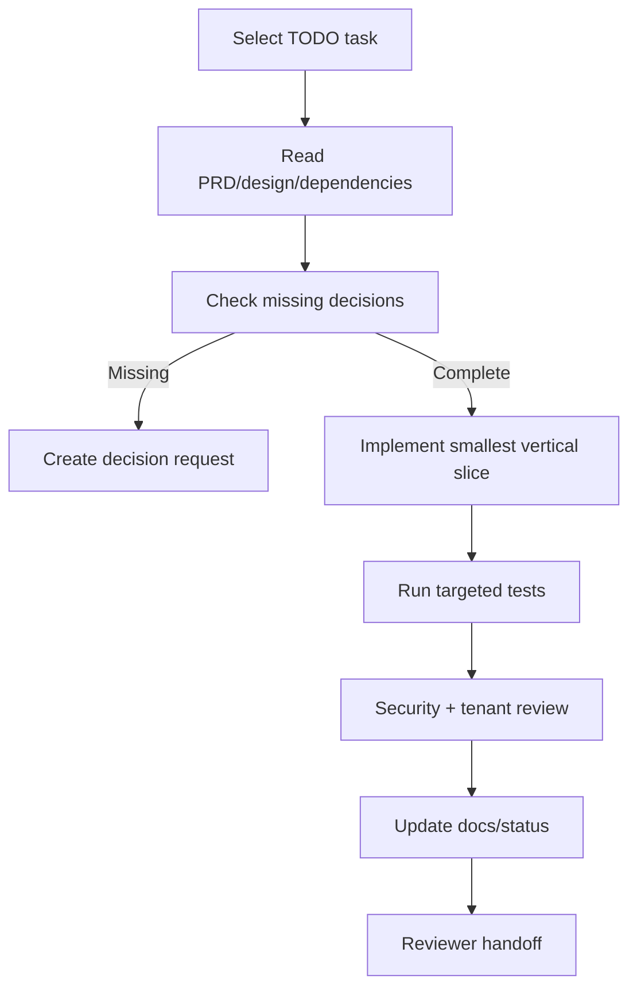

# IndoLicense AI Development Workflow

## 1. Before Coding

Agent harus membaca PRD, technical design, database design, task backlog, dan task yang ditugaskan.
Untuk task database, minta dan validasi Supabase configuration terlebih dahulu.

## 2. Execution Loop



## 3. Required Handoff Format

```markdown
## Task Result
- Task ID:
- Status:
- Files changed:
- Migration:
- API/UI changes:
- Business rules implemented:
- Security/tenant checks:
- Tests run and result:
- Known limitations:
- Follow-up tasks:
```

## 4. Test Pyramid

1. Domain unit tests: status, expiry, entitlement, normalization.
2. Repository/integration tests: constraints, transaction, migration.
3. Authorization tests: cross-tenant and role matrix.
4. API contract tests: envelope, errors, rate limit, idempotency.
5. E2E tests: critical user journeys only.

## 5. Review Checklist

- [ ] Scope sesuai Task ID.
- [ ] Tidak ada business logic di UI/route handler.
- [ ] Organization scope enforced pada setiap resource query.
- [ ] Input divalidasi dengan Zod.
- [ ] Error code konsisten.
- [ ] Retry/idempotency/concurrency ditangani.
- [ ] Audit dan usage side effects benar.
- [ ] Secret dan PII tidak masuk response/log.
- [ ] Migration reversible/aman dan sudah direview.
- [ ] Test negatif authorization tersedia.
- [ ] PRD/design/backlog diperbarui jika ada keputusan baru.

## 6. Definition of Done

Task hanya boleh `DONE` apabila implementation, tests, security review, migration review,
documentation, dan handoff report selesai. Code yang hanya “berhasil compile” belum dianggap
selesai.
