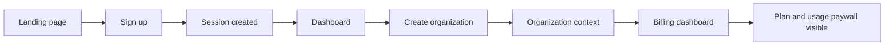

# Critical Browser Journey

T-052 diverifikasi dengan Playwright CLI pada development server localhost.

## Journey



## Manual verification

Start the application:

```bash
npm run dev
```

Then use Playwright CLI to open `/auth/sign-up`, create a disposable QA account, verify redirect to `/dashboard`, create an organization through the authenticated organization API, and open `/dashboard/{organizationId}/billing`.

Expected results:

- Signup creates a Better Auth user and session.
- Dashboard renders the signed-in user.
- Organization context renders the owner role and tenant name.
- Billing renders `No active plan`, available platform plans, and the usage paywall empty state.
- Browser console has no application errors on the organization and billing pages.

Use a disposable QA email and clean up test data according to the database retention policy. Do not use a production customer account for browser testing.
