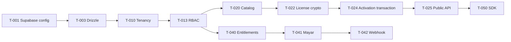

# IndoLicense MVP Task Backlog

Status: `TODO` | `IN_PROGRESS` | `BLOCKED` | `DONE`

## Phase 0 — Decisions and Setup

| ID | Task | Dependency | Acceptance |
|---|---|---|---|
| T-001 | Konfirmasi Supabase project/config dan environment | None | Config tersedia tanpa secret di repository |
| T-002 | Bootstrap Next.js, TypeScript, lint, test, env validation | T-001 | `dev`, typecheck, lint, test berjalan |
| T-003 | Setup Drizzle ORM/Kit/Studio dan migration pipeline | T-001,T-002 | Migration dapat diterapkan ke Supabase |
| T-004 | Dokumentasikan error catalog, API envelope, request_id | T-002 | Contract test tersedia |
| T-005 | Finalize platform plans, trial, grace, pricing, rate limits | T-001 | Decision record disetujui Product |

## Phase 1 — Identity and Tenancy

| ID | Task | Dependency | Acceptance |
|---|---|---|---|
| T-010 | Schema users, organizations, memberships | T-003 | Migration + constraints + seed |
| T-011 | Signup/signin/session/logout/password reset | T-002,T-010 | Critical auth tests pass |
| T-012 | Organization switcher and membership context | T-011 | User hanya melihat tenant aktif |
| T-013 | RBAC policy Owner/Admin/Developer/Viewer | T-010 | Authorization matrix tested server-side |
| T-014 | Cross-tenant security test suite | T-013 | All negative access cases pass |

## Phase 2 — Catalog and Licensing Core

| ID | Task | Dependency | Acceptance |
|---|---|---|---|
| T-020 | Schema products and product license plans | T-010,T-003 | FK/index/slug constraints pass |
| T-021 | Product/plan application services and dashboard | T-013,T-020 | CRUD + archive + authorization pass |
| T-022 | License key crypto/generation and customer schema | T-020 | High entropy, hash-only persistence |
| T-023 | License lifecycle/status evaluator | T-022 | Unit tests for active/expired/suspended/revoked |
| T-024 | Activation transaction and idempotency | T-023 | Concurrent limit test passes on PostgreSQL |
| T-025 | Public activate/validate/deactivate endpoints | T-024,T-004 | Contract, auth, error, rate-limit tests pass |
| T-026 | License/customer/activation dashboard | T-025 | Pagination, filters, role policy pass |

## Phase 3 — Security and Operations

| ID | Task | Dependency | Acceptance |
|---|---|---|---|
| T-030 | API key creation/hash/rotation/revocation | T-013 | Secret shown once; revoked key rejected |
| T-031 | Public and management API rate limiting | T-025,T-005 | 429 + Retry-After + abuse log |
| T-032 | Audit log service and critical events | T-024,T-025 | Actor/resource/request_id recorded |
| T-033 | Structured logging and error monitoring | T-002 | Secret/PII masking verified |
| T-034 | Backup/restore and migration runbook | T-003 | Restore drill documented |

## Phase 4 — Billing and Entitlements

| ID | Task | Dependency | Acceptance |
|---|---|---|---|
| T-040 | Platform plans and entitlement evaluator | T-005,T-010 | Quotas are config-driven |
| T-041 | Mayar checkout/order/payment adapter | T-040 | Checkout reference persisted |
| T-042 | Webhook verification and idempotent event store | T-041 | Duplicate/tampered event tests pass |
| T-043 | Subscription state machine, trial, grace period | T-042,T-005 | State transition tests pass |
| T-044 | Upgrade/downgrade/cancellation policy | T-043 | Immediate/scheduled behavior tested |
| T-045 | Billing dashboard and usage paywall | T-040,T-043 | UI explains effect before confirmation |

## Phase 5 — DX and Release

| ID | Task | Dependency | Acceptance |
|---|---|---|---|
| T-050 | PHP reference SDK | T-025 | Timeout/retry/error/cache behavior tested |
| T-051 | Integration documentation and examples | T-050 | Copy/paste examples work |
| T-052 | Playwright critical journey | T-026,T-045 | Signup-to-license and billing sandbox pass |
| T-053 | Production readiness review | T-031,T-034,T-052 | Security/NFR/rollback checklist signed off |

## Critical Path

