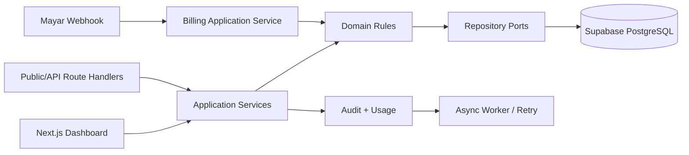

# IndoLicense Technical Design

## 1. Architecture Decision

IndoLicense menggunakan modular monolith berbasis Next.js App Router. Dashboard, public
license API, vendor management API, dan Mayar webhook berada dalam satu deployable application,
dengan business logic terpisah berdasarkan domain.



## 2. Layer Rules

| Layer | Responsibility | Tidak boleh |
|---|---|---|
| Route/UI | Parse input, session, policy check, call service, present response | Menyimpan business rule |
| Contract | Zod request/response schema dan error code | Query database |
| Application | Use case, transaction boundary, orchestration | Bergantung pada React |
| Domain | Status transition, expiry, activation policy, entitlement rule | Bergantung pada HTTP/provider |
| Repository | Query dan persistence | Menentukan authorization/business policy |
| Infrastructure | Drizzle, Supabase, Mayar, rate limiter, email | Dipanggil langsung dari UI |

## 3. Module Boundary

```text
src/
├── app/                         # pages, layouts, route handlers
├── modules/
│   ├── identity/                # users, organizations, memberships, RBAC
│   ├── catalog/                 # products, product license plans
│   ├── licensing/               # licenses, activations, status rules
│   ├── billing/                 # platform plans, orders, payments, subscriptions
│   ├── entitlements/            # quota/feature evaluation
│   ├── developer-api/           # API keys, public API, rate limit
│   ├── audit/                   # immutable audit events
│   └── platform-admin/          # support and internal operations
├── infrastructure/
│   ├── db/                      # Drizzle schema, migrations, repositories
│   ├── providers/               # Mayar and email adapters
│   ├── jobs/                    # retry/reconciliation jobs
│   └── observability/
└── shared/                      # contracts, errors, crypto, result helpers
```

## 4. Runtime Flows

### License Activation

```text
POST /api/v1/licenses/activate
 -> validate Zod contract
 -> resolve public product + license hash
 -> apply public rate limit
 -> licensing.activate() transaction
 -> audit/usage event
 -> minimal response
```

Activation transaction wajib lock/equivalent atomic update pada license, mencari activation
berdasarkan `(license_id, installation_id)`, dan memastikan active count tidak melewati limit.

### License Validation

```text
POST /api/v1/licenses/validate
 -> validate request
 -> rate limit
 -> hash/resolve license
 -> evaluate effective status
 -> return minimal response
```

### Payment Webhook

```text
Mayar webhook
 -> verify signature/payload
 -> persist provider + event_id idempotently
 -> map provider event
 -> update payment/order/subscription transactionally
 -> recalculate entitlement
 -> enqueue retry/reconciliation if needed
```

## 5. Credential Model

| Caller | Credential |
|---|---|
| Dashboard | User session + organization membership/role |
| Customer software | `product_public_id` + license key + installation context |
| Vendor management API | Scoped secret API key |
| Mayar | Provider signature/secret verification |
| Internal job | Server-side worker identity |

Secret API key tidak boleh berada di browser atau distributed plugin/package.

## 6. Better Auth, Supabase, and Drizzle

- Supabase PostgreSQL menjadi target database sejak development awal.
- Drizzle schema adalah definisi tabel aplikasi.
- Drizzle Kit menghasilkan dan menerapkan migration.
- Drizzle Studio hanya untuk inspect/debug terbatas.
- Schema tidak diedit manual melalui Supabase Dashboard.
- Semua environment memakai migration repository yang sama.
- Better Auth menangani user, session, account, dan verification.
- Authorization tenant/RBAC tetap menjadi tanggung jawab application layer.
- Supabase hanya menjadi PostgreSQL managed; tidak ada ketergantungan terhadap Supabase Auth,
  Data API, atau client SDK.

Better Auth dipilih untuk menjaga portability jika IndoLicense nantinya dipindahkan ke VPS
dengan PostgreSQL milik sendiri. Auth tables tetap berada di database aplikasi dan dikelola
melalui Drizzle adapter. Provider, session, dan verification flow harus diakses melalui Auth
Adapter agar domain service tidak bergantung pada library tertentu.

Environment minimum:

```text
DATABASE_URL=Supabase direct connection string
DATABASE_POOL_URL=Supabase pooled connection string (if runtime needs it)
BETTER_AUTH_URL=http://localhost:3000
BETTER_AUTH_SECRET=server-only secret
```

## 7. Non-Functional Baseline

- Public validate p95 <= 500 ms pada kondisi normal.
- Public activate p95 <= 800 ms pada kondisi normal.
- Public API rate limit menghasilkan HTTP 429 + `Retry-After`.
- API v1 hanya menerima additive changes; breaking change memakai v2.
- Semua critical mutation memiliki audit event dan `request_id`.
- Semua list memakai pagination dan query tidak boleh mengambil `SELECT *` tanpa alasan.
