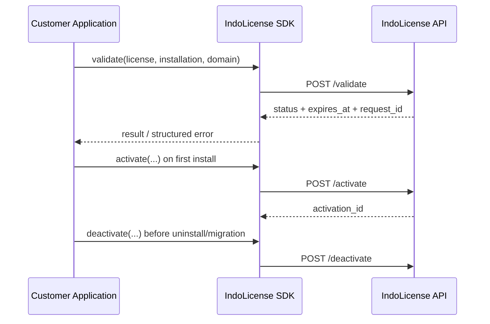

# IndoLicense Integration Guide

Panduan ini untuk developer yang mengintegrasikan license IndoLicense ke aplikasi mereka.

## Prerequisites

1. Buat Product dan Product License Plan di IndoLicense Dashboard.
2. Salin `product_public_id` dari product. Nilainya berbentuk `prod_...` dan aman untuk dikirim ke aplikasi client.
3. Simpan license key dengan aman. Jangan menaruh license key vendor atau credential management API di browser.
4. Gunakan `installation_id` yang stabil untuk satu instalasi aplikasi. Panjang minimal 8 karakter dan hanya boleh berisi huruf, angka, `.`, `_`, `:`, atau `-`.

Base URL API:

```text
https://your-indolicense.example.com
```

## API contract

Semua endpoint memakai `POST` dan JSON dengan payload yang sama:

```json
{
  "product_public_id": "prod_abc123456789012345678901",
  "license_key": "IL-EXAMPLE-KEY",
  "installation_id": "server-01",
  "domain": "example.com"
}
```

Endpoint:

| Operation | Endpoint | Cache |
|---|---|---|
| Validate | `/api/v1/licenses/validate` | Boleh cache singkat |
| Activate | `/api/v1/licenses/activate` | Jangan cache |
| Deactivate | `/api/v1/licenses/deactivate` | Jangan cache |

Response sukses menggunakan envelope berikut:

```json
{
  "data": {
    "license_id": "uuid",
    "product": "prod_abc123456789012345678901",
    "plan": "Pro",
    "status": "active",
    "valid": true,
    "expires_at": "2027-01-01T00:00:00.000Z"
  },
  "error": null,
  "request_id": "uuid"
}
```

`request_id` perlu disimpan di log aplikasi agar support dapat menelusuri kegagalan. Public API menggunakan rate limit validate 60 request/menit dan activate/deactivate 10 request/menit per product, action, dan IP. Saat menerima `429`, hormati header `Retry-After`.

## cURL

```bash
curl -X POST "$INDOLICENSE_URL/api/v1/licenses/validate" \
  -H 'Content-Type: application/json' \
  -d '{"product_public_id":"prod_abc123456789012345678901","license_key":"IL-EXAMPLE-KEY","installation_id":"server-01","domain":"example.com"}'
```

## PHP

```bash
composer require indolicense/php-sdk
```

```php
use IndoLicense\IndoLicenseClient;
use IndoLicense\IndoLicenseException;

$client = new IndoLicenseClient($_ENV['INDOLICENSE_URL']);

try {
    $result = $client->validate(
        $_ENV['INDOLICENSE_PRODUCT_PUBLIC_ID'],
        $_ENV['INDOLICENSE_LICENSE_KEY'],
        'server-01',
        $_SERVER['HTTP_HOST'] ?? 'example.com',
    );
    if (($result['status'] ?? null) !== 'active') {
        throw new RuntimeException('License is not active.');
    }
} catch (IndoLicenseException $error) {
    error_log(sprintf('IndoLicense %s (%s)', $error->errorCode, $error->requestId ?? 'no-request-id'));
    // Fail closed for protected features, but show a useful renewal message.
}
```

## JavaScript/TypeScript

```bash
npm install @indolicense/javascript
```

```ts
import { IndoLicenseClient, IndoLicenseError } from '@indolicense/javascript';

const client = new IndoLicenseClient(process.env.INDOLICENSE_URL!);

try {
  const result = await client.validate({
    productPublicId: process.env.INDOLICENSE_PRODUCT_PUBLIC_ID!,
    licenseKey: process.env.INDOLICENSE_LICENSE_KEY!,
    installationId: 'server-01',
    domain: 'example.com',
  });
  if (result.status !== 'active') throw new Error('License is not active.');
} catch (error) {
  if (error instanceof IndoLicenseError) {
    console.error(error.errorCode, error.requestId);
  }
  throw error;
}
```

## Recommended application flow



- Jalankan `activate` saat instalasi atau first run, bukan setiap request aplikasi.
- Jalankan `validate` saat startup dan secara berkala sesuai kebutuhan produk.
- Jalankan `deactivate` saat uninstall atau perpindahan instalasi.
- Cache hanya hasil validate secara singkat. Jika cache expired, lakukan validate ulang.
- Untuk kegagalan network sementara, SDK melakukan retry terbatas. Jangan membuat retry loop tambahan tanpa backoff.
- Jangan log license key penuh; mask minimal sebagian karakter jika perlu troubleshooting.

## Error handling

| Code | Tindakan |
|---|---|
| `LICENSE_NOT_FOUND` | Tampilkan license tidak ditemukan/cek input |
| `LICENSE_EXPIRED` | Minta renewal |
| `LICENSE_SUSPENDED` / `LICENSE_REVOKED` | Blokir fitur berlisensi dan hubungi vendor |
| `ACTIVATION_LIMIT_REACHED` | Minta deactivate instalasi lama |
| `RATE_LIMITED` | Tunggu `Retry-After`, jangan retry agresif |
| `NETWORK_ERROR` | Gunakan cache validate terakhir secara terbatas bila kebijakan produk mengizinkan |

## Security checklist

- License key boleh berada di server aplikasi customer; jangan expose management API key.
- Gunakan HTTPS untuk semua environment non-local.
- Bind license ke installation ID dan domain yang benar.
- Jangan menganggap response client-side sebagai bukti pembayaran; API IndoLicense adalah source of truth.
- Uji activate/deactivate dengan installation ID yang sama untuk memastikan idempotency.
